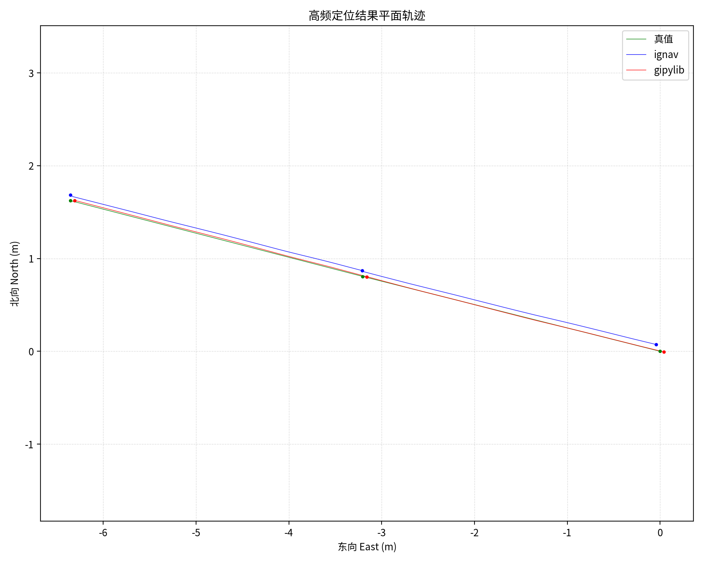
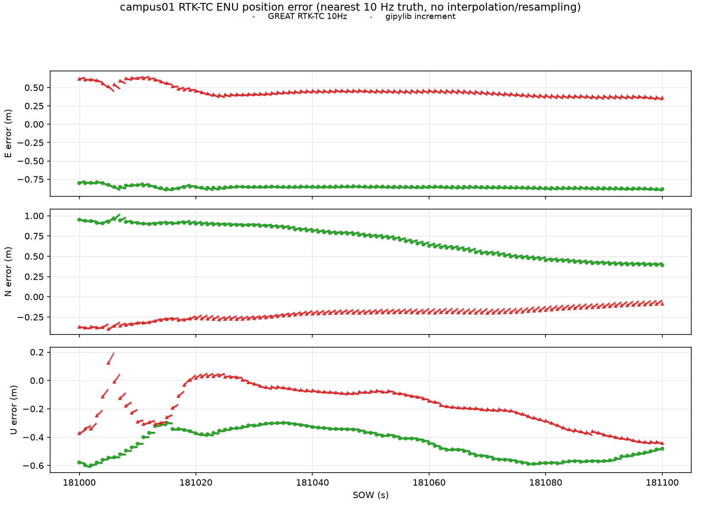
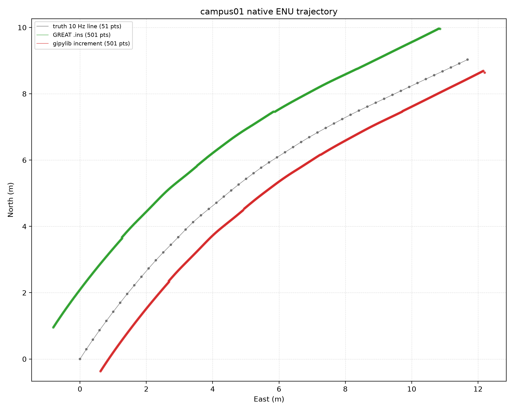

# gipylib

基于流式读取的 GNSS/INS 组合导航后处理程序（Python）。

## 功能简介

本项目可完成以下定位解算：

- **纯 GNSS 解算**：SPP（单点定位）、DGPS（差分 GPS）、RTK（PPK 事后动态相对定位）
- **松组合导航**（LC）：GNSS 定位结果 + IMU 机械编排 + EKF 融合，输出 100Hz 位置/速度/姿态
- **紧组合导航**（TC）：GNSS 原始观测值 + IMU 机械编排 + EKF 融合，可在 GNSS 信号恶劣环境下保持导航连续性

## 程序特点

- **纯 AI 开发**：项目架构由作者设计，全部代码由 AI 编写，主体由GLM系列（GLM5.1->GLM5.2->GLM5.3 flash）完成，小部分由gpt,deepseek完成
- **流式读取**：采用 Python 流式读取 GNSS 观测与 IMU 数据，不一次性加载全部数据到内存，内存占用低
- **保留抗差接口**：滤波器内置创新值拒绝与异常检测接口，可扩展抗差估计
- **非完整性约束接口**：NHC/ZUPT/ZARU 约束作为独立模块，通过配置文件使能，可自主开关
- **可自主开发**：代码结构清晰，模块化设计，便于二次开发与算法替换
- **可自主开发**：速率式imu数据处理参考ignav，增量式数据处理参考KF-GINS和GREAT-MSF
- **低成本传感器支持**：支持手机级低成本 IMU + GNSS 的紧组合解算，可适配不同精度等级的传感器数据

## 快速开始

### 环境依赖

```bash
pip install -r requirements.txt
```

需要 Python 3.8+，依赖 numpy、PyYAML、pytest。

### 运行程序

准备符合[配置手册](man/manual.md)要求的配置文件与观测数据后，运行：

```bash
python3 src/main.py <配置文件路径>
```

程序会根据配置生成定位与组合导航结果：

- `RTK.pos`：纯 GNSS 定位结果（1Hz）
- `RTKLC.rslt`：松组合导航结果
- `RTKTC.rslt`：紧组合导航结果

## 配置说明

通过修改配置文件中的 `ins.enabled` 字段切换运行模式：

| `ins.enabled` | 模式 | 说明 | 输出文件 |
|---------------|------|------|----------|
| `off` | 纯 GNSS | 仅 GNSS 解算（SPP/RTK/RTD） | `.pos` |
| `lc` | 松组合 | GNSS + IMU LC EKF 融合 | `.pos` + `.csv` + `.rslt` |
| `tc` | 紧组合 | GNSS 原始观测 + IMU TC EKF 融合 | `.rslt` |

详细配置参数说明请参考 [man/manual.md](man/manual.md)。

## 结果对比

以下结果使用 GREAT-MSF 的 `sample_data/MSF_20201027` `campus01` 数据集：流动站观测为 `GNSS/Rover/campus-day.20O`，基站观测为 `GNSS/Base/WUH200CHN_R_20203010200_15M_01S_MO.crx.20O` 和 `GNSS/Base/WUH200CHN_R_20203010215_15M_01S_MO.crx.20O`，星历为 `GNSS/Product/BRDM00DLR_S_20203010000_01D_MN.rnx`，IMU 为 100 Hz 速率数据 `IMU/campus-01-MEMS.txt`。

<table>
<tr>
<td align="center"><br>gipylib 与 ignav2s 的轨迹差异</td>
<td align="center"><br>gipylib 与 GREAT RTK-TC 的 ENU 定位误差</td>
<td align="center"><br>gipylib 与 GREAT/真值的 ENU 轨迹差异</td>
</tr>
</table>

## 目录结构

```
gipylib/
├── README.md                  # 项目说明
├── requirements.txt           # Python 依赖
├── .gitignore
├── pytest.ini                 # pytest 配置
├── src/                       # 源代码
│   ├── main.py                # 主入口
│   ├── core/
│   │   ├── gnss/              # GNSS 解算（含 rtklib-py 子模块）
│   │   ├── ins/               # INS 机械编排 + 松组合 EKF
│   │   ├── tc/                # 紧组合 EKF
│   │   ├── data_types.py      # 数据类型定义
│   │   ├── time_utils.py      # 时间转换工具
│   │   └── thread_control.py  # 线程控制
│   ├── log/                   # 输出与日志
│   ├── stream/                # 流式数据读取传感器
│   └── utility/               # 配置加载与 RINEX 简化
├── skills/                    # 设计文档（AI 开发需求说明）
└── man/
    └── manual.md              # 配置文件使用手册
```

## 致谢

本项目参考了以下开源程序，在此表示感谢：

- [GINav](https://github.com/kaichen686/GINav)：MATLAB 组合导航
- [GREAT-MSF](https://github.com/GREAT-WH-UAV/GREAT-MSF)：C++ 多传感器融合框架
- [GVINS](https://github.com/HKUST-Aerial-Robotics/GVINS)：GNSS-Visual-Inertial 紧组合
- [ignav](https://github.com/rtkgps/ignav)： GNSS/INS 组合导航
- [KF-GINS](https://github.com/i2Nav-WHU/KF-GINS)：C++ 卡尔曼滤波组合导航
- [pyrinex](https://github.com/geospace-code/pyrinex)：Python RINEX 解析
- [rtklib-py](https://github.com/rtklib-py/rtklib-py)：Python 版 RTKLIB

## 不足之处

- 不支持 PPP（精密单点定位），不支持实时定位
- 仅支持后处理
- 作者水平有限，如有问题欢迎反馈交流

## 建议

- 本项目保留设计时的 `skills/` 文档，记录了各模块的设计思路与算法推导
- 建议使用者尽量用 AI 辅助开发，但需将需求描述清楚，AI 才能生成符合预期的代码，欢迎反馈交流，更欢迎使用AI工具完善本项目
