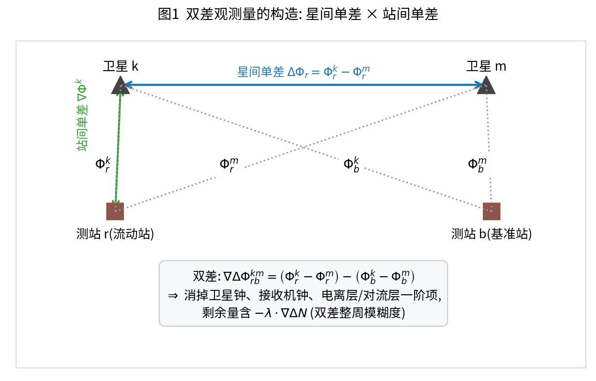
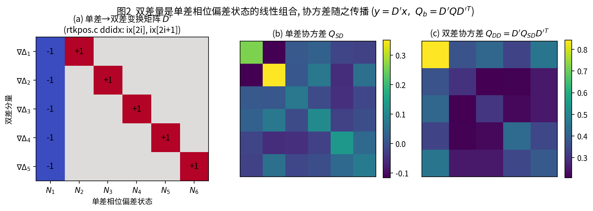
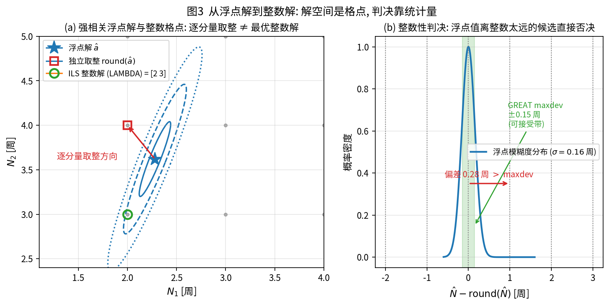
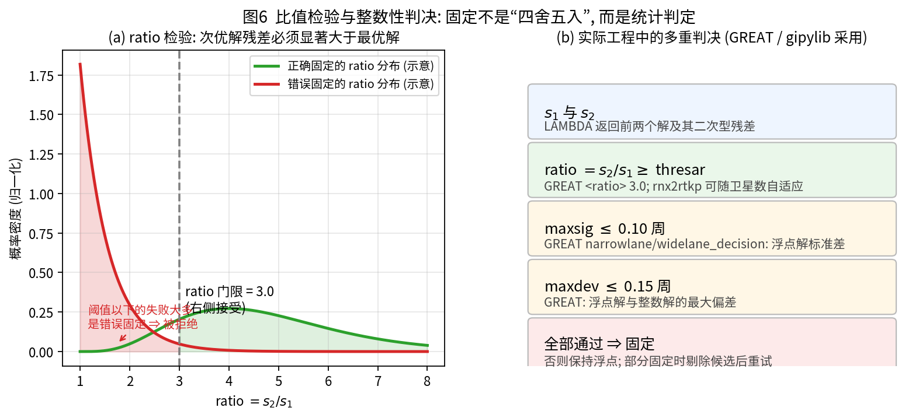
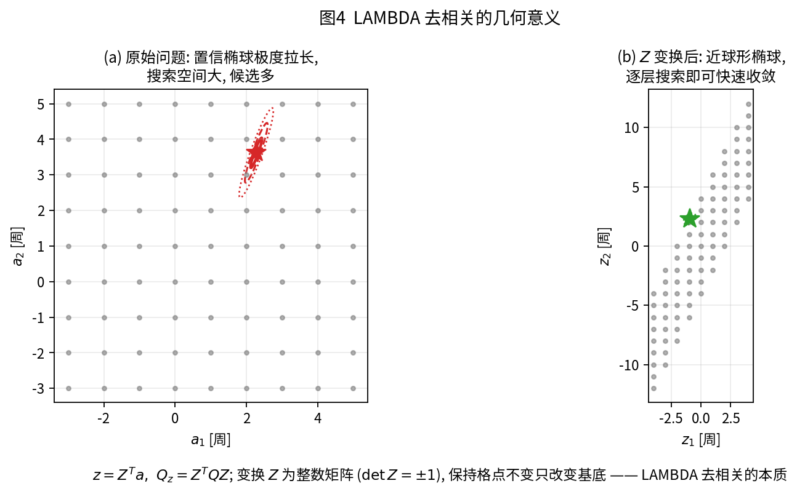
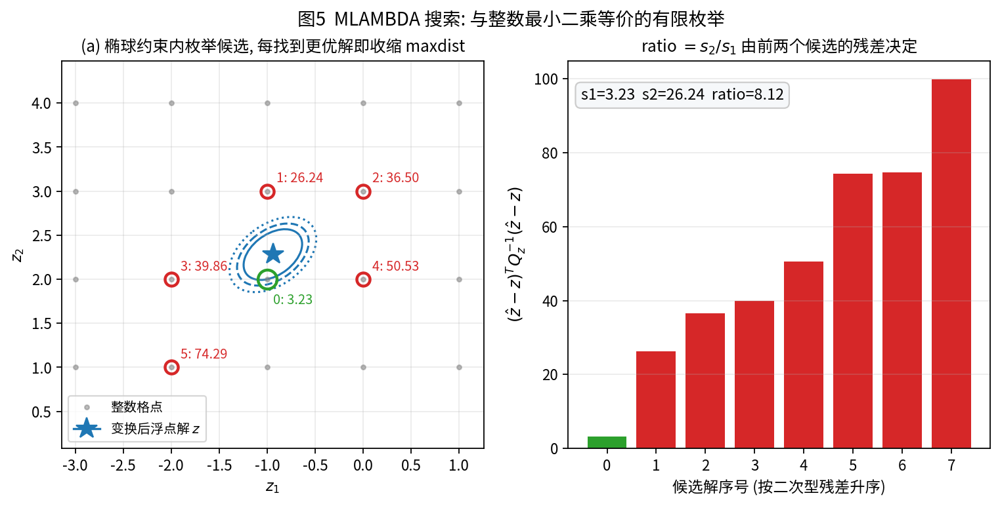
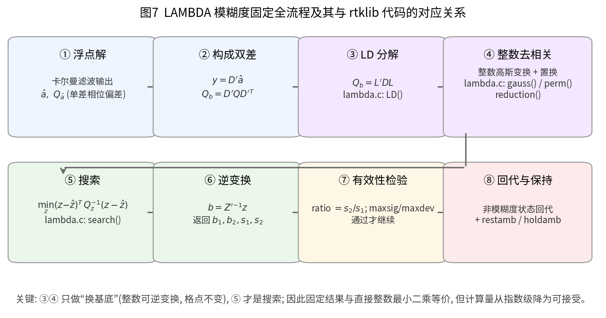
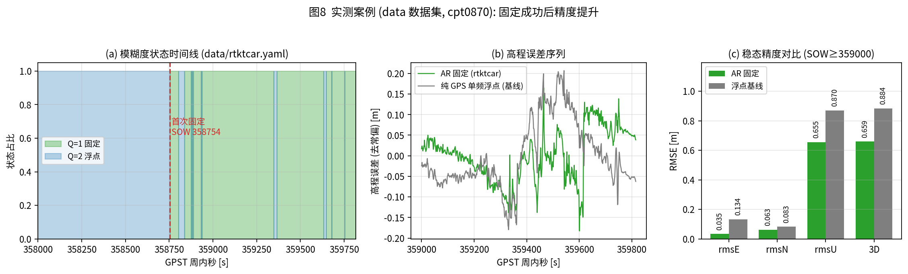

# 模糊度固定原理与 rtklib(rnx2rtkp) / GREAT 实现分析

> 本文回答三个问题：
> 1. **单差/双差浮点模糊度究竟是什么**，为什么它一定是整数；
> 2. **LAMBDA 算法如何从「浮点解 + 协方差」得到整数解**（公式 + 图，数形结合）；
> 3. **rtklib（rnx2rtkp）与 GREAT 的代码是怎么做的**，工程上还有哪些必备判决。
>
> 图片来源：`skills/图片/*.png`，由 `skills/图片/generate_ambiguity_figures.py` 生成（可复现）。
> 代码引用：`/home/mxl/workplace/rnx2rtkp/src/{rtkpos.c,lambda.c}`（本文所有行号均指该仓库）。
> 实测数据：`data/`(cpt0870) 与 `data-great/`(campus01)，配置见 `data/rtktcar.yaml`、`data-great/rtktcar.yaml`。

---

## 0. 结论速览

| 概念 | 一句话说明 |
|---|---|
| 浮点解 $\hat a$ | 卡尔曼滤波估计出的**双差整周模糊度实数解**及其协方差 $Q_{\hat a}$ |
| 整数解 | 真值必然落在整数格点 $\mathbb{Z}^n$ 上，固定就是从格点中挑出最可信的一个 |
| LAMBDA | = **整数可逆变换去相关**（把拉长的椭球变成近球形）+ **有限枚举搜索**（与整数最小二乘等价） |
| 固定判决 | 不是"四舍五入"，而是统计判定：`ratio` 检验 + （GREAT）`maxdev`/`maxsig` 整数性判决 |
| 固定后的收益 | 正确固定可把位置精度提升到 cm 级；**错误固定会引入米级偏差**，比不固定更糟 |

三种整数估计器（都从同一个浮点解出发）：

$$
\underbrace{\check a_{IR}=\mathrm{round}(\hat a)}_{\text{逐分量取整，成功率最低}}
\qquad
\underbrace{\check a_{IB}=\text{顺序条件取整}}_{\text{bootstrapping}}
\qquad
\underbrace{\check a_{ILS}=\arg\min_{z\in\mathbb{Z}^n}(\hat a-z)^{T}Q_{\hat a}^{-1}(\hat a-z)}_{\text{整数最小二乘，成功率最高}}
$$

**LAMBDA 求解的正是 $\check a_{ILS}$**，但把指数级枚举压缩到可接受的规模。

---

## 1. 从观测方程到双差模糊度

### 1.1 原始观测方程

对卫星 $s$ 与接收机 $r$，载波相位 $\Phi$ 与伪距 $P$（单位：m）：

$$
\begin{aligned}
\Phi_{r}^{s} &= \rho_{r}^{s} + c\left(dt_r - dt^{s}\right) + T_{r}^{s} - I_{r}^{s}
              + \lambda N_{r}^{s} + \varepsilon_{\Phi}\\
P_{r}^{s}   &= \rho_{r}^{s} + c\left(dt_r - dt^{s}\right) + T_{r}^{s} + I_{r}^{s}
              + \varepsilon_{P}
\end{aligned}
$$

其中 $N_{r}^{s}\in\mathbb{Z}$ 为**整周模糊度**（相位观测值只能记到不足一周的小数部分，整周数未知）。

### 1.2 三次作差：消掉公共误差



$$
\begin{aligned}
\text{星间单差 (SD)}:&\quad \Delta\Phi_r^{km}=\Phi_r^{k}-\Phi_r^{m}
   &&\text{消卫星钟、卫星位置误差}\\
\text{站间+星间双差 (DD)}:&\quad
   \nabla\Delta\Phi_{rb}^{km}=\left(\Phi_r^{k}-\Phi_r^{m}\right)-\left(\Phi_b^{k}-\Phi_b^{m}\right)
   &&\text{再消接收机钟、共同大气项}
\end{aligned}
$$

短基线下双差方程非常干净：

$$
\boxed{\;\nabla\Delta\Phi_{rb}^{km}=\nabla\Delta\rho_{rb}^{km}+\lambda\,\nabla\Delta N_{rb}^{km}+\nabla\Delta\varepsilon\;}
$$

即：**双差观测量 = 几何距离双差（与位置有关）+ 波长 × 双差整周模糊度 + 噪声**。
双差模糊度仍为整数：$\nabla\Delta N_{rb}^{km}=N_r^k-N_r^m-N_b^k+N_b^m\in\mathbb{Z}$。

### 1.3 线性化与状态分块

设基线向量（或流动站位置改正）为 $b$，双差模糊度为 $a$，线性化后

$$
y = A\,b + B\,a + \varepsilon,\qquad a\in\mathbb{Z}^{n}
$$

卡尔曼滤波（或最小二乘）给出浮点解及其协方差，按 $(b,a)$ 分块：

$$
\hat x=\begin{bmatrix}\hat b\\ \hat a\end{bmatrix},\qquad
Q=\begin{bmatrix}Q_{\hat b} & Q_{\hat b\hat a}\\ Q_{\hat a\hat b} & Q_{\hat a}\end{bmatrix}
$$

**关键：$Q_{\hat a}$ 不是对角的**。相邻卫星对、相邻频点的双差模糊度强相关（相关系数常达 0.9 以上），这正是"逐分量取整会出错"的根源（见图 3）。

### 1.4 rtklib 的工程选择：状态是单差，固定用双差

rtklib 并不把双差模糊度作为滤波状态，而是**每个卫星每个频点一个单差（SD）相位偏差状态** $x_{\text{bias}}$，固定时才组合成双差：



`rtkpos.c: ddidx()` 为每个系统/频点挑选**参考星**（第一个满足条件的卫星）与**候选星**，把 $(i,j)$ 状态对写入 `ix[]`：

```c
/* rtkpos.c:1552-1558  —— D 系数: 目标星 j 减去参考星 i */
ix[nb*2  ]=i; /* state index of ref bias */
ix[nb*2+1]=j; /* state index of target bias */
ref[nb]=i-k+1;
fix[nb++]=j-k+1;
```

`resamb_LAMBDA()` 中据此构造双差量与协方差（$D'$ 的作用）：

```c
/* rtkpos.c:1728-1739 */
for (i=0;i<nb;i++) {
    y[i]=rtk->x[ix[i*2]]-rtk->x[ix[i*2+1]];              /* y = D' * x̂   */
}
for (j=0;j<nx-na;j++) for (i=0;i<nb;i++) {
    DP[i+j*nb]=rtk->P[ix[i*2]+(na+j)*nx]-rtk->P[ix[i*2+1]+(na+j)*nx];
}
for (j=0;j<nb;j++) for (i=0;i<nb;i++) {
    Qb[i+j*nb]=DP[i+(ix[j*2]-na)*nb]-DP[i+(ix[j*2+1]-na)*nb];   /* Qb=D'Q D'ᵀ */
}
for (j=0;j<nb;j++) for (i=0;i<na;i++) {
    Qab[i+j*na]=rtk->P[i+ix[j*2]*nx]-rtk->P[i+ix[j*2+1]*nx];    /* Qab=Qac D'ᵀ */
}
```

$$
y=D'\hat a,\qquad Q_b=D'Q_{\hat a}D'^{T}
$$

> 工程含义：**单差状态的数量、参考星的选择**直接决定 $Q_b$ 的条件数。参考星高度角过低或周跳未清，$Q_b$ 会变坏，导致后面搜索失败或伪固定。

---

## 2. 从浮点解到整数解：数学提法

### 2.1 浮点解的统计意义

浮点解满足 $\hat a\sim\mathcal{N}(a,\,Q_{\hat a})$，真值 $a$ 落在以 $\hat a$ 为中心、$Q_{\hat a}$ 为形状的椭球内（1σ/2σ/3σ 置信椭球）。



图 3(a) 说明：当 $Q_{\hat a}$ 强相关（斜长椭圆）时，
- 逐分量取整得到的是 (2, 4)；
- 而**整数最小二乘**的答案是 (2, 3)（椭圆内离中心最近的格点）；
- 也就是说，**"看起来离得更远"的整数解反而加权残差更小**——因为协方差把方向上的权重改变了。

图 3(b) 是 1 维示意：即使只看一个模糊度，"取整"也要在统计上验证（GREAT 的 `maxdev=0.15` 周即这条带）。

### 2.2 三种估计器与成功率

给定浮点解，$a$ 的最佳整数估计（最大后验/最小错误概率意义上）是 ILS：

$$
\check a_{ILS}=\arg\min_{z\in\mathbb{Z}^{n}}\;(\hat a-z)^{T}Q_{\hat a}^{-1}(\hat a-z)
$$

其成功率上界可用条件方差的 Teunissen 公式估计（bootstrapped 成功率）：

$$
P_{s,IB}=\prod_{i=1}^{n}\left(2\Phi\!\left(\frac{1}{2\sigma_{i|I}}\right)-1\right),
\qquad
\sigma_{i|I}^{2}=Q_{i,i}-\sum_{j<i}\frac{Q_{i,j}^{2}}{Q_{j,j}}
$$

- 关系：$P_{s,IR}\le P_{s,IB}\le P_{s,ILS}$；
- 因此**先看 $\sigma_{i|I}$ 是否够小**（对应 GREAT 的 `maxsig`），再谈固定；
- 这也解释了实测中的"死循环"：$\sigma\approx0.21$ 周时 $2\Phi(1/(2\cdot0.21))-1\approx0.98$，$n=9$ 时 $P_{s,IB}\approx0.83$，看着不低，但**一旦整数性判决按 0.10 周卡 σ，就一个候选都无法输出**（见第 7 节实测）。

### 2.3 固定不是"取整"，而是判决

$$
\text{固定} \iff
\begin{cases}
\text{ratio}=s_2/s_1\ge \text{thresar} & \text{(次优解残差必须显著更大)}\\
\max_i|\hat a_i-\check a_i|\le \texttt{maxdev} & \text{(GREAT 0.15 周)}\\
\max_i\sqrt{Q_{i,i}}\le \texttt{maxsig} & \text{(GREAT 0.10 周)}
\end{cases}
$$



其中 $s_1,s_2$ 是 LAMBDA 返回的**前两个候选**的二次型残差。GREAT 的
`<widelane_decision maxdev="0.15" maxsig="0.10" alpha="1000"/>` 就是上表后两条，
`<ratio>` 是第一条。**三道门缺一不可**：实测中放宽 `maxsig` 会放进伪固定，精度反而劣化（第 7 节）。

---

## 3. LAMBDA：去相关 + 搜索



### 3.1 为什么要去相关

直接对 $(\hat a,Q_{\hat a})$ 枚举，椭球被拉得很长，需要检查大量格点。LAMBDA 的核心是找一个**整数变换** $Z$（$|\det Z|=1$），令

$$
z=Z^{T}a,\qquad Q_z=Z^{T}Q_{\hat a}Z
$$

- $|\det Z|=1$ ⇒ **格点集合不变**（只是换了基底），整数解可无损还原 $a=Z^{-T}z$；
- 变换后椭球尽量"圆"（对角、方差接近），于是**逐层搜索的剪枝效率极高**。

图 4 给出直观对比：(a) 原始椭球长短轴比 ~8，方向斜；(b) 变换后近球形（示例中 1σ/2σ 圆几乎重合）。

### 3.2 去相关的实现：LD 分解 + 整数高斯变换

`lambda.c` 用 LD 分解与两类整数基本变换（都是整数可逆）：

```c
/* lambda.c:28-44   Q = L' * diag(D) * L */
static int LD(int n, const double *Q, double *L, double *D)
{
    memcpy(A,Q,sizeof(double)*n*n);
    for (i=n-1;i>=0;i--) {
        if ((D[i]=A[i+i*n])<=0.0) {info=-1; break;}   /* 必须正定 */
        a=sqrt(D[i]);
        for (j=0;j<=i;j++) L[i+j*n]=A[i+j*n]/a;
        for (j=0;j<=i-1;j++) for (k=0;k<=j;k++) A[j+k*n]-=L[i+k*n]*L[i+j*n];
        for (j=0;j<=i;j++) L[i+j*n]/=L[i+i*n];
    }
    ...
}
```

```c
/* lambda.c:46-54   整数高斯变换: 列 j ← 列 j − μ·列 i, μ 取整 */
static void gauss(int n, double *L, double *Z, int i, int j)
{
    if ((mu=(int)ROUND(L[i+j*n]))!=0) {
        for (k=i;k<n;k++) L[k+n*j]-=(double)mu*L[k+i*n];   /* L 上做变换 */
        for (k=0;k<n;k++) Z[k+n*j]-=(double)mu*Z[k+i*n];   /* Z 同步累积 */
    }
}
```

```c
/* lambda.c:56-72   整数置换: 交换相邻状态, 保证 D 单调下降 */
static void perm(int n, double *L, double *D, int j, double del, double *Z)
{ ... eta=D[j]/del; lam=D[j+1]*L[j+1+j*n]/del; ... }
```

```c
/* lambda.c:74-89   去相关主循环: 交替做高斯变换与置换, 直到 D 不再下降 */
static void reduction(int n, double *L, double *D, double *Z)
{
    j=n-2; k=n-2;
    while (j>=0) {
        if (j<=k) for (i=j+1;i<n;i++) gauss(n,L,Z,i,j);
        del=D[j]+L[j+1+j*n]*L[j+1+j*n]*D[j+1];
        if (del+1E-6<D[j+1]) { perm(n,L,D,j,del,Z); k=j; j=n-2; }  /* 改善则置换后重来 */
        else j--;
    }
}
```

> 判决条件 `del + 1e-6 < D[j+1]` 是"是否值得交换"的充分条件（等价于 LAMBDA 的交换判据），
> 每次置换都把 $j$ 重置为 $n-2$，即反复迭代直到字典序稳定。

### 3.3 搜索：MLAMBDA（深度优先 + 剪枝）



去相关后，问题化为

$$
\min_{z\in\mathbb{Z}^{n}}\;(z-\hat z)^{T}Q_z^{-1}(z-\hat z)
=\min_{z\in\mathbb{Z}^{n}}\sum_{i=1}^{n}\frac{\left(z_i-\hat z_i
 +\sum_{j>i}(z_j-\hat z_j)L_{j,i}\right)^{2}}{D_i}
$$

正因为用了 $L,D$ 的三角结构，可以**从第 $n$ 层往第 1 层**逐层定界（每层给出整数区间），
一旦部分和超过当前最优 `maxdist` 就回溯——这就是 `search()`：

```c
/* lambda.c:109-152 */
for (c=0;c<LOOPMAX;c++) {
    newdist=dist[k]+y*y/D[k];              /* 当前层的部分二次型 */
    if (newdist<maxdist) {
        if (k!=0) {                        /* Case 1: 下探一层, 更新条件中心 zb[k] */
            dist[--k]=newdist;
            for (i=0;i<=k;i++)
                S[k+i*n]=S[k+1+i*n]+(z[k+1]-zb[k+1])*L[k+1+i*n];
            zb[k]=zs[k]+S[k+k*n];
            z[k]=ROUND(zb[k]); y=zb[k]-z[k]; step[k]=SGN(y);
        }
        else {                             /* Case 2: 得到一个完整候选, 维护最优 m 个 */
            if (nn<m) { ... s[nn++]=newdist; }
            else if (newdist<s[imax]) { ...; maxdist=s[imax]; }   /* 收缩椭球 */
            z[0]+=step[0]; y=zb[0]-z[0]; step[0]=-step[0]-SGN(step[0]);
        }
    }
    else {                                 /* Case 3: 超界, 回溯或结束 */
        if (k==n-1) break; else { k++; z[k]+=step[k]; y=zb[k]-z[k];
                                  step[k]=-step[k]-SGN(step[k]); }
    }
}
```

要点：
1. `m=2`：只保留最优和次优两个解，正好够算 ratio；
2. `maxdist` 单调收缩（越搜越快），`LOOPMAX=10000` 防死循环；
3. 复杂度从 $O(\text{格点总数})$ 降为"沿椭球主轴附近的有限枚举"。



`lambda()` 把上述步骤串起来（注意最后一步要**变回原基底**）：

```c
/* lambda.c:180-206 */
extern int lambda(int n, int m, const double *a, const double *Q, double *F, double *s)
{
    L=zeros(n,n); D=mat(n,1); Z=eye(n); z=mat(n,1); E=mat(n,m);
    if (!(info=LD(n,Q,L,D))) {                    /* ① LD 分解 */
        reduction(n,L,D,Z);                        /* ② 去相关 (gauss+perm) */
        matmul("TN",n,1,n,Z,a,z);                  /* ③ z = Z' a */
        if (!(info=search(n,m,L,D,z,E,s))) {       /* ④ 搜索（已去相关） */
            info=solve("T",Z,E,n,m,F);             /* ⑤ F = Z'⁻¹ E: 变回原基底 */
        }
    }
    return info;
}
```

---

## 4. 固定之后：回代（adjust）与保持（hold）

### 4.1 非模糊度状态回代（最小二乘条件解）

已知整数解 $\check a$，位置等实数参数的最优更新为条件最小二乘：

$$
\boxed{\;\check b=\hat b-Q_{\hat b\hat a}Q_{\hat a}^{-1}\left(\hat a-\check a\right),
\qquad
Q_{\check b}=Q_{\hat b}-Q_{\hat b\hat a}Q_{\hat a}^{-1}Q_{\hat a\hat b}\;}
$$

`resamb_LAMBDA()` 中的关键段落（`b` 为整数解，`y` 为 $\hat a-b$）：

```c
/* rtkpos.c:1786-1799 */
for (i=0;i<nb;i++) { bias[i]=b[i]; y[i]-=b[i]; }        /* y = â − ǎ */
if (!matinv(Qb,nb)) {
    matmul("NN",nb,1,nb,Qb ,y,db);                      /* db  = Qb⁻¹(â−ǎ)      */
    matmulm("NN",na,1,nb,Qab,db,rtk->xa);               /* xa  = x̂ − Qab·db      */
    matmul("NN",na,nb,nb,Qab,Qb ,QQ);                   /* QQ  = Qab·Qb⁻¹        */
    matmulm("NT",na,na,nb,QQ ,Qab,rtk->Pa);             /* Pa  = P  − QQ·Qabᵀ    */
    restamb(rtk,bias,nb,xa);                            /* 双差 → 单差 写回      */
}
```

> 这一步同时把协方差"收缩"了：固定后 $Q_{\check b}$ 远小于 $Q_{\hat b}$，这正是固定能提升精度的数学来源。

### 4.2 双差 → 单差写回（restamb）

滤波状态是单差，因此要把双差整数解还原到单差：

$$
x_a[\text{ref}]=x[\text{ref}],\qquad
x_a[\text{sat}_j]=x_a[\text{ref}]-\text{bias}_j
$$

```c
/* rtkpos.c:1596-1600 */
xa[index[0]]=rtk->x[index[0]];
for (i=1;i<n;i++) {
    xa[index[i]]=xa[index[0]]-bias[nv++];     /* 参考星保持浮点, 其余 = 参考星 − DD 整数 */
}
```

### 4.3 hold：把已固定的模糊度"钉住"（FIXHOLD）

`holdamb()` 把"固定解与浮点解之差"作为**伪观测**喂回滤波器，使模糊度在后续历元保持：

$$
v_j=\left(x_a[\text{ref}]-x_a[\text{sat}_j]\right)-\left(x[\text{ref}]-x[\text{sat}_j]\right),\qquad
R_j=\texttt{varholdamb}
$$

```c
/* rtkpos.c:1626-1648 */
for (i=1;i<n;i++) {
    v[nv]=(xa[index[0]]-xa[index[i]])-(rtk->x[index[0]]-rtk->x[index[i]]);
    H[index[0]+nv*rtk->nx]= 1.0;
    H[index[i] +nv*rtk->nx]=-1.0;
    nv++;
}
if (rtk->opt.modear==ARMODE_FIXHOLD&&nv<rtk->opt.minholdsats) return;  /* 卫星太少不强 hold */
rtk->holdamb=1;
for (i=0;i<nv;i++) R[i+i*nv]=rtk->opt.varholdamb;
filter(rtk->x,rtk->P,H,v,R,rtk->nx,nv);                                 /* 约束更新 */
```

GLONASS/SBAS 还有一段**把相位偏差中的小数部分搬到频间偏差 `icbias`** 的处理（IFB 吸收），
避免小数部分被错误地"整数化"：

```c
/* rtkpos.c:1668-1671 */
dd=rtk->x[IB(j+1,f,&rtk->opt)]-rtk->x[IB(i+1,f,&rtk->opt)];
dd=rtk->opt.gainholdamb*(dd-ROUND(dd));   /* 去掉整数部分, 只搬小数部分 */
rtk->x[IB(j+1,f,&rtk->opt)]-=dd;          /* 从相位偏差中减去 */
rtk->ssat[j].icbias[f]+=dd;               /* 塞进 icbias */
```

---

## 5. rnx2rtkp 代码走读（relpos → 固定）

### 5.1 调用链

```
relpos()                       /* rtkpos.c:1975  逐历元相对定位主循环 */
 └─ manage_amb_LAMBDA()        /* rtkpos.c:1827  门限判断 + 多次尝试 + 剔除策略 */
     └─ resamb_LAMBDA()        /* rtkpos.c:1701  标准 LAMBDA 固定流程 */
         ├─ ddidx()            /* rtkpos.c:1506  单差状态 → 双差索引/参考星 */
         ├─ lambda()           /* lambda.c:180   LD → reduction → search */
         ├─ restamb()          /* rtkpos.c:1576  双差整数 → 单差状态 */
         └─ (holdamb())        /* rtkpos.c:1604  FIXHOLD 约束 */
```

### 5.2 候选星筛选（ddidx）：什么卫星可以参与固定

```c
/* rtkpos.c:1526-1541  —— 找参考星: 必须是"可用且未发生半周跳"的星 */
for (i=k;i<k+MAXSAT;i++) {
    if (rtk->x[i]==0.0||!test_sys(rtk->ssat[i-k].sys,m)||!rtk->ssat[i-k].vsat[f]) continue;
    if (rtk->ssat[i-k].lock[f]>=0 && !(rtk->ssat[i-k].slip[f]&LLI_HALFC) &&
        rtk->ssat[i-k].azel[1]>=rtk->opt.elmaskar && !nofix) {
        rtk->ssat[i-k].fix[f]=2;   /* fix 候选 */
        break;
    }
    else rtk->ssat[i-k].fix[f]=1;  /* 只做浮点 */
}
```

要点（都是实践中踩过的坑）：
- `lock[f]>=0`：新升起的卫星（lock<0）不参与固定；
- `slip[f]&LLI_HALFC`：半周跳未解决时**禁止**固定（否则整周假定不成立）；
- `azel[1]>=elmaskar`：固定的高度角门限比定位门限更严（默认 `elmaskar=0`，可配置）；
- 每系统/频点至少 `minfixsats-1` 对（`resamb_LAMBDA` 开头即检查）：

```c
/* rtkpos.c:1713-1721 */
ix=imat(nx,2);
if ((nb=ddidx(rtk,ix,gps,glo,sbs))<(rtk->opt.minfixsats-1)) {
    errmsg(rtk,"not enough valid double-differences\n");
    return -1;                                    /* 直接放弃本次固定 */
}
```

### 5.3 标准 LAMBDA 固定（resamb_LAMBDA）

```c
/* rtkpos.c:1751-1814 精简 */
if (!(info=lambda(nb,2,y,Qb,b,s))) {                 /* ① LAMBDA: 前2个候选 + 残差 */
    rtk->sol.ratio=s[0]>0?(float)(s[1]/s[0]):0.0f;   /* ② ratio = s2/s1 */
    if (rtk->sol.ratio>999.9) rtk->sol.ratio=999.9f;
    ...
    if (s[0]<=0.0||s[1]/s[0]>=rtk->sol.thres) {      /* ③ ratio 检验 */
        for (i=0;i<na;i++) { rtk->xa[i]=rtk->x[i];  ... }   /* 实数状态初始化 */
        for (i=0;i<nb;i++) { bias[i]=b[i]; y[i]-=b[i]; }    /* y = â − ǎ */
        if (!matinv(Qb,nb)) {                                /* ④ 回代 + 协方差收缩 */
            matmul("NN",nb,1,nb,Qb ,y,db);
            matmulm("NN",na,1,nb,Qab,db,rtk->xa);
            matmul("NN",na,nb,nb,Qab,Qb ,QQ);
            matmulm("NT",na,na,nb,QQ ,Qab,rtk->Pa);
            restamb(rtk,bias,nb,xa);                         /* ⑤ DD → SD */
        }
        else nb=0;
    }
    else { errmsg(rtk,"ambiguity validation failed ..."); nb=0; }  /* 保持浮点 */
}
```

注意两点工程细节：
1. **ratio 门限随卫星数自适应**（`thresar[5] != thresar[6]` 时用多项式拟合调整），因为候选越多、$s_2/s_1$ 越容易偏小：

```c
/* rtkpos.c:1758-1774 */
if (opt->thresar[5]!=opt->thresar[6]) {
    nb1=nb<50?nb:50;
    for (i=0;i<3;i++) { coeff[i]=ar_poly_coeffs[i][0];
                        for (j=1;j<5;j++) coeff[i]=coeff[i]*opt->thresar[0]+ar_poly_coeffs[i][j]; }
    rtk->sol.thres=coeff[0];
    for (i=1;i<3;i++) rtk->sol.thres=rtk->sol.thres*1.0/(nb1+1.0)+coeff[i];
    rtk->sol.thres=MIN(MAX(rtk->sol.thres,opt->thresar[5]),opt->thresar[6]);
} else rtk->sol.thres=(float)opt->thresar[0];
```

2. **$\hat a-\check a$ 的解释**：`y[i]-=b[i]` 之后 $y$ 就是双差的"浮点−整数"偏差，
   再乘 $Q_{ab}Q_b^{-1}$ 就完成了状态回代（对应 §4.1 的公式）。

### 5.4 位置方差门限、剔除与多次尝试（manage_amb_LAMBDA）

实际环境中，个别卫星的模糊度（低高度角、多路径、非模型化偏差）会拖垮整体 ratio。
rtklib 在 LAMBDA 外层做"门限 + 剔除 + 重试"，这相当于工程化的**部分固定**：

**(1) 位置方差门限：解本身还没收敛时不要固定**

```c
/* rtkpos.c:1832-1848 */
for (int i=0;i<3;i++) posvar+=rtk->P[i+i*rtk->nx];      /* 位置三分量方差均值 */
posvar/=3.0;
if (rtk->opt.mode<=PMODE_DGPS||rtk->opt.modear==ARMODE_OFF||
    rtk->opt.thresar[0]<1.0||posvar>rtk->opt.thresar[1]) {   /* thresar[1] 默认 0.25 m² */
    trace(3,"Skip AR\n");
    rtk->sol.ratio=0.0; rtk->nb_ar=0;
    return 0;
}
```

**(2) 跨历元剔除策略：如果上一历元没固定成功，本历元先"试探性屏蔽"一颗卫星**

```c
/* rtkpos.c:1849-1884 精简 */
if (rtk->sol.prev_ratio2 < rtk->sol.thres && rtk->nb_ar >= rtk->opt.mindropsats) {
    /* 找到下一颗可用卫星, 把它的 lock 设为负值, 从而在本次 AR 中不可用 */
    rtk->ssat[excsat-1].lock[f] = -rtk->nb_ar;   /* remove sat from AR long enough to enable hold */
}
...
/* rtkpos.c:1932-1937 若仍未固定, 恢复该卫星 */
if (excsat && (rtk->sol.ratio < rtk->sol.thres) &&
    (rtk->sol.ratio < 1.5 * rtk->sol.prev_ratio2)) {
    for (int f=0;f<nf;f++) rtk->ssat[excsat-1].lock[f] = lockc[f];
    trace(3, "AR: restore sat %d\n", excsat);
}
```

**(3) 三次 LAMBDA 尝试**

```c
/* rtkpos.c:1886-1918 */
gps1=1;                                        /* GPS 首轮总是参加 */
glo1=(rtk->opt.navsys&SYS_GLO)?(((rtk->opt.glomodear==GLO_ARMODE_FIXHOLD)&&!rtk->holdamb)?0:1):0;
sbas1=...;
nb=resamb_LAMBDA(rtk,bias,xa,gps1,glo1,sbas1); /* ① 首轮: 全系统 */

if (rtk->opt.arfilter) {                       /* ② AR 滤波: 比值骤降 ⇒ 剔除新升起卫星后重试 */
    if (nb>=0 && rtk->sol.prev_ratio2>=rtk->sol.thres &&
        ((rtk->sol.ratio<rtk->sol.thres) ||
         (rtk->sol.ratio<rtk->opt.thresar[0]*1.1 && rtk->sol.ratio<rtk->sol.prev_ratio1/2.0))) {
        dly=2;
        for (int i=0;i<ns;i++) for (int f=0;f<nf;f++) {
            if (rtk->ssat[sat[i]-1].fix[f]!=2) continue;
            if (rtk->ssat[sat[i]-1].lock[f]==0) {                 /* 新卫星 */
                rtk->ssat[sat[i]-1].lock[f]=-rtk->opt.minlock-dly; /* 交错延迟启用 */
                dly+=2; rerun=1;
            }
        }
    }
    if (rerun) nb=resamb_LAMBDA(rtk,bias,xa,gps1,glo1,sbas1);
}

/* rtkpos.c:1922-1931 ③ GLONASS 修跟踪模式下再关掉 GLO/SBAS 重试 */
if ((rtk->opt.navsys&SYS_GLO) && rtk->opt.glomodear==GLO_ARMODE_FIXHOLD &&
    rtk->sol.ratio<rtk->sol.thres) {
    glo2=sbas2=0;
    gps2 = rtk->opt.gpsmodear==0 && rtk->sol.ratio>=rtk->sol.thres ? 0 : 1;
    if (glo1!=glo2||gps1!=gps2) nb=resamb_LAMBDA(rtk,bias,xa,gps2,glo2,sbas2);
}
```

对照 GREAT：GREAT 的 `part_fix` 是**在搜索内部**按候选方差剔除（数学上等价于"去掉某些模糊度后重新做 ILS"），
而 rtklib 是**在 LAMBDA 外层**通过改变参与集合达成同样的目的，两者思路一致。

### 5.5 FIXHOLD 模式下的完整闭环

```c
/* rtkpos.c:2150-2160 附近 */
nv=ddres(rtk,obs,dt,xa,Pp,sat,y,e,azel,freq,iu,ir,ns,v,NULL,R,vflg);
...
if (rtk->opt.modear==ARMODE_FIXHOLD && rtk->nb_ar>0)
    holdamb(rtk,xa);                        /* 已固定 → 用约束把整数钉住 */
```

`holdamb` 之后再回代一次，就得到"固定解"输出（`Q=1`）。

### 5.6 关键参数一览（rtklib 默认值取自 `rtkcmn.c:204-226`）

| 参数 | 含义 | 默认值 | 说明 |
|---|---|---|---|
| `modear` | AR 模式 | **3 = FIXHOLD** | 0=off / 1=continuous / 2=instantaneous / 3=fix-and-hold |
| `thresar[0]` | ratio 门限 | 3.0 | 用 `thresar[5]=thresar[6]=3.0` 时不做随卫星数自适应 |
| `thresar[1]` | 位置方差门限 | **0.25 m²** | `posvar` 超限直接跳过 AR（`rtkpos.c:1842`） |
| `elmaskar` / `elmaskhold` | 参与固定/保持的高度角 | 0.0° | 需要时可调高做保守固定 |
| `minlock` | 参与 AR 的最小锁定 | 0 | GREAT 对应项为 `min_common_time = 30 s` |
| `minfixsats` | 固定最少卫星对 | **4** | 代码用 `nb >= minfixsats-1` |
| `minholdsats` | hold 最少卫星对 | 5 | 不足则不 hold |
| `mindropsats` | 允许剔除卫星的最小对数 | 10 | 见 §5.4(2) |
| `varholdamb` | hold 约束方差 | **0.1**（gipylib 用 0.001） | 越小钉得越死 |
| `gainholdamb` | IFB 小数搬运增益 | 0.01 | GLONASS/SBAS |
| `arfilter` | AR 后处理滤波 | 1 | 比值骤降时剔除新星重试 |
| `armaxiter` | AR 迭代上限 | 1 | |
| `gpsmodear/glomodear/bdsmodear` | 分系统 AR 开关 | 1 / 3 / 0 | GLONASS 默认走 ICB + fix&hold |
| `stats-prnbias` | **模糊度过程噪声** | **1e-4 m** | 见下方注 |

> `stats-prnbias`（`prcopt.prn[0]`）是 rtklib 中相位偏差状态的过程噪声，默认 **1e-4 m**
> （约 5e-4 周），在 `rtkpos.c:863` 处以
> `P[j,j] += prn[0]*prn[0]*|tt|` 注入。**它极小是刻意的**：载波相位在失锁前是常量，
> 模糊度不应被过程噪声"推着走"。这与第 7.4 节的实测结论完全一致
> （gipylib `prnbias` 设 0.03 周时 σ 托底 0.21 周、AR 永远无法启动；设 0.001 周才正常）。

---

## 6. GREAT 的做法（与 rtklib 的差异）

GREAT 的实现在 `GREAT-MSF/src/LibGREAT/gambfix/gambiguity.cpp`（约 2530 行）+
配置 `gset/gsetamb.cpp`，与 rtklib 单级 LAMBDA 的差别在于：

| 机制 | GREAT | rtklib |
|---|---|---|
| 分级固定 | **EWL → WL → NL** 逐级（TCAR），每级单独 LAMBDA + 判决 | 单级（直接 L1/L2 组合） |
| 最少候选 | `<full_fix_num> 3` | `minfixsats-1`（默认 3） |
| 最小共视时间 | `<min_common_time> 30` s | 用 `lock` 计数间接体现 |
| 部分固定 | `<part_fix>`：全量失败 → 按方差/锁定剔除候选重试，保底 `<part_fix_num> 2` | `manage_amb_LAMBDA` 的分系统子集重试 |
| 整数性判决 | `<widelane_decision maxdev=0.15 maxsig=0.10>`、`<narrowlane_decision ...>` | 仅 ratio 检验 |
| bootstrapping 门限 | `<boot>`（默认关闭 -0.001） | 无 |

GREAT 的 `maxdev`/`maxsig` 判决是**比 ratio 更本质的一道门**：ratio 只看"最优 vs 次优"，
而 maxdev/maxsig 直接检验"浮点解是否像整数"。实测证明它不可或缺（见 §7.3）。

---

## 7. 实测案例：gipylib 的 TC 模糊度固定

### 7.1 gipylib 的实现要点

`src/core/tc/tc_ambiguity.py::TcAmbiguity` 与 rtklib 等价的部分：

$$
y_i = N_{\text{ref}}-N_{j_i},\qquad
Q_{dd}[i][k]=\mathrm{Cov}\!\left(N_{\text{ref}}-N_{j_i},\;N_{\text{ref}}-N_{j_k}\right)
$$

> 注意两者的**符号必须一致**：若 $y=N_{\text{ref}}-N_j$，则写回时 $N_j=N_{\text{ref}}-\check b_j$；
> 早期版本 $y$ 用 $N_{\text{ref}}-\text{sign}\cdot N_j$ 而协方差用 $N_{\text{ref}}-N_j$，属于不一致，
> 会造成"浮点离整偏差"虚高（实测 `maxdev` 0.30~0.45 周 → 修正后 0.12~0.20 周）。

此外补齐了 GREAT 的四项机制（`full_fix_num`、`min_common_time`、`part_fix`、`maxdev/maxsig`），
详见 `issue/9-16模糊度固定完善.md`。

### 7.2 实测：固定成功带来的精度提升



`data/rtktcar.yaml`（GPS 双频 + AR，`prnbias: 0.001`）对比 `data/rtk-ins紧组合.yaml`
（纯 GPS 单频浮点基线），窗口 SOW≥359000（truth.csv 真值，816 历元）：

| 方案 | rmsE | rmsN | rmsU | 3D RMSE |
|---|---|---|---|---|
| 纯 GPS 单频浮点（基线） | 0.134 | 0.083 | 0.870 | **0.884 m** |
| 双频浮点（无固定） | 0.102 | 0.211 | 0.847 | 0.879 m |
| **双频 + AR 固定（Q=1 占 96%）** | **0.035** | **0.063** | **0.655** | **0.659 m** |

首次固定出现在 SOW 358754，其后 358900 段固定率 95%、359000 之后 100%（图 8a）。

### 7.3 反例：为什么"放宽判决"是错的

同一份数据（`prnbias=0.03` 时 σ≈0.21 周），把 `ar_maxsig`（对应 GREAT `maxsig`）从 0.10 放宽到 1.0：

| 方案 | 固定历元数 | rmsU | 3D RMSE |
|---|---|---|---|
| 严格判决（maxsig 0.10） | 0（σ≈0.21 > 0.10，全部被否决） | 0.847 | 0.879 m |
| 放宽 maxsig 1.0 | 293 | **1.072** | **1.087 m** |

放宽后虽然 ratio 中位数高达 690，但高程 RMS 反而劣化 0.22 m —— **伪固定**。
这与 §2.3 的结论一致：ratio 检验只比较"最优与次优"，无法识别**系统性模型偏差**
（未改正的相位中心/IFB/多路径）导致的"整数看起来很近"。

> 结论：**"固定率"不是指标，"用真值评估的精度"才是**。宁可保持浮点，也不能放宽判决换固定率。

### 7.4 另一个反例：过程噪声太大导致永远无法固定

`prnbias`（模糊度随机游走 σ，单位周）直接决定稳态 $\sigma_{\hat a}$ 的地板：

| `prnbias` | 稳态 maxsig | 严格判决下能否固定 | 说明 |
|---|---|---|---|
| 0.03 | ≈0.21 周 > 0.10 | **否**（1378 次尝试 0 次通过） | σ 被过程噪声托底，形成"先固定才降 σ"的死循环 |
| 0.001 | ≈0.095 周 ✓ | **是**（稳态 96% 历元固定） | 载波相位在失锁前是常量，物理上更合理 |

rtklib 的做法与此一致：`stats-prnbias` 默认 **1e-4 m ≈ 5e-4 周**（见 §5.6 注），
即"模糊度几乎是常量"，因此 σ 只由观测噪声决定，而不是被过程噪声托底。

---

## 8. 实践检查清单（踩坑汇总）

1. **符号一致性**：$y$ 的定义、$Q_{dd}$ 的构造、写回公式三者必须来自同一个定义。
2. **状态与双差**：SD 状态 → DD 组合时注意参考星；参考星切换/周跳会使 $Q_{DD}$ 突变。
3. **过程噪声**：模糊度过程噪声应接近 0（失锁前为常量）；过大 ⇒ σ 托底 ⇒ 永远无法固定。
4. **周跳与半周跳**：`LLI_HALFC`、`lock<0` 的卫星必须排除在固定之外。
5. **判决三件套**：ratio、maxdev、maxsig 缺一不可；只放宽阈值会带来伪固定（§7.3）。
6. **部分固定**：先剔除"低锁定/大方差"候选再搜索，能显著提高可用性（GREAT `part_fix`）。
7. **hold 的副作用**：假固定会被 hold 长期保持，因此**宁可漏固定不可错固定**；
   建议对 hold 加"连续多历元一致"与"位置方差"双重门限。
8. **精度评估**：固定效果必须用真值评估；只看 ratio 或只看 Q=1 的占比会自欺。

---

## 9. 参考

1. P. J. G. Teunissen, *Least-squares estimation of the integer GPS ambiguities*, 1993；
   *The least-squares ambiguity decorrelation adjustment: a method for fast GPS integer ambiguity estimation*, J. Geodesy, 1995.
2. X.-W. Chang, X. Yang, T. Zhou, *MLAMBDA: a modified LAMBDA method for integer least-squares estimation*, J. Geodesy, 2005.
3. rtklib 源码：`src/lambda.c`、`src/rtkpos.c`（本仓库 `/home/mxl/workplace/rnx2rtkp`）。
4. GREAT 源码：`src/LibGREAT/gambfix/gambiguity.cpp`、`src/LibGREAT/gset/gsetamb.cpp`
   （`GREAT-MSF` 仓库）。
5. 本仓库实测记录：`issue/9-16模糊度固定完善.md`、`issue/8-24浮点解协方差差距.md`、
   配置 `data/rtktcar.yaml`、`data-great/rtktcar.yaml`，评估脚本
   `data/plot/evaluate_rtktcar.py`、`data-great/plot/evaluate_campus01.py`。
6. 图片生成脚本：`skills/图片/generate_ambiguity_figures.py`。
